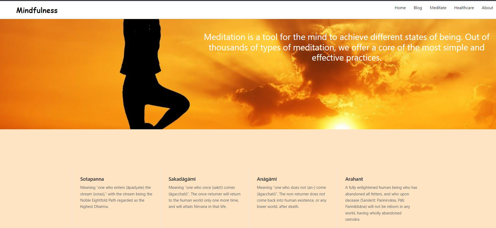
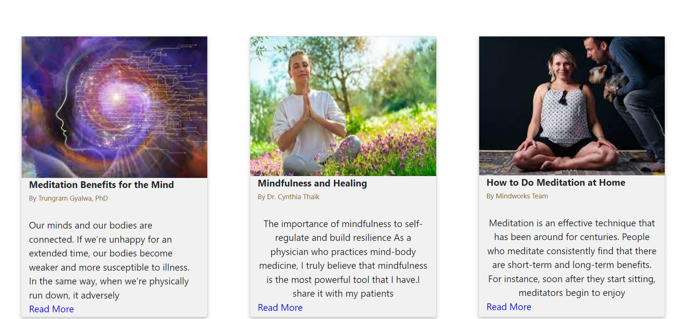

 

  <h2>Meditation App</h2>
  

 

<h3>Description</h3>
  
  

   Practicing meditation through a meditation app helps you tune into your body and stay in the present moment with exercises and expert advice. Being mindful through meditation has been shown to help improve your focus on tasks in everyday life as well as process new information. Using an app as a guide while you meditate can also help you build up your meditation skill set, which may in turn help you access a calm, focused state in your day-to-day life more easily. This app have the advantage of providing intuitive tools, like trackers, that can help keep you accountable and improve over time and background video.
 <h3>Home page</h3>

 
  

 <h3>Meditation</h3>
 

  
https://user-images.githubusercontent.com/66422118/149760760-2527c4a0-87e7-4b30-9e00-34dfe8fc5f9a.mp4
   
 

 <h3>Blog</h3>
 

 
 

 
 
  <h3> 🖲️Tech Stack🖱</h3>
 
 * Frontend (HTML,CSS,JS)

   
 
 
